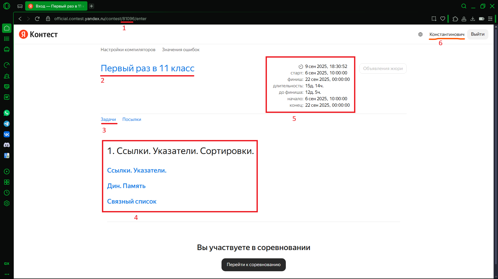
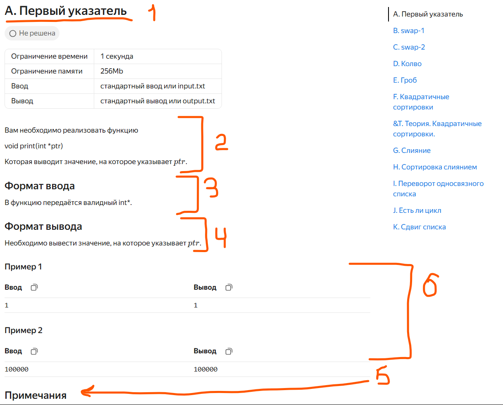
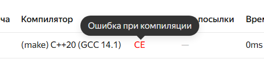
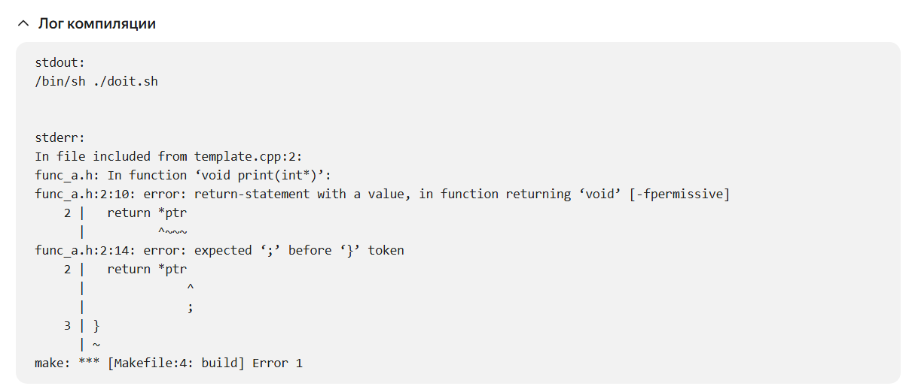
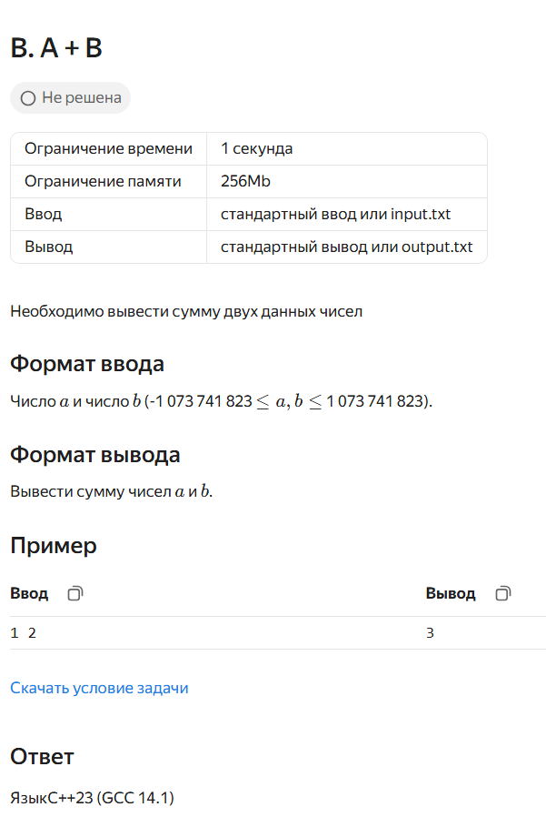
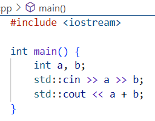
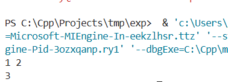
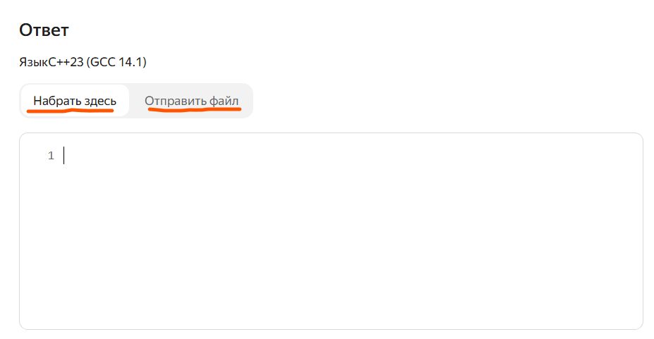
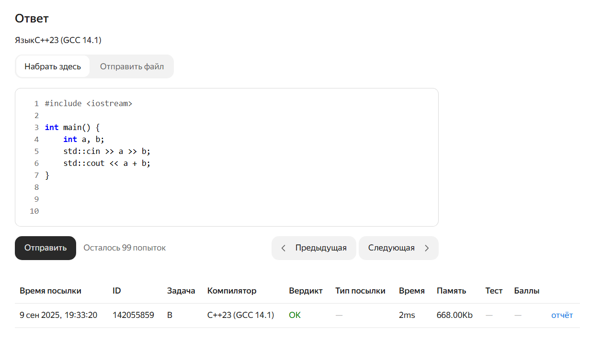

Всем привет! Сегодня мы поговорим о работе с Яндекс Контестом как с тестирующей системой. Сначала давайте разберем то, что у нас есть, когда мы открываем контест 



##### Так называемая "плашка перед контестом"

1. Id контеста - все контесты обладают общей ссылкой official.contest.yandex.ru/contest/\<ID>. По факту, чтобы найти контест, вам не нужна вся ссылка, а лишь его ID, по нему можно будет легко найти и сам контест (например поэтому ID контрольных пишется на доске только во время контрольной)
2. Название контеста - обычно смешное
3. Необходимая вам кнопка "Задачи", то есть то, с чего всё начинается
4. Плашка, которую я прошу вас читать. Там будут предупреждения или как минимум ссылки на презентации
5. Тут указано время начала, конца, сколько осталось и остальная временная информация
6. Тут указан ваш пользователь, проверьте что тут ваше ФИО

##### Задачи 



1. Название задачи
2. Легенда задачи -- тут описано приятное условие, чтобы понять необходимые абстракции, обозначения и т.д.
3. Формат ввода - всё, что вы получаете через `std::cin`. Если у вас указано, что сначала вводятся два числа, а потом строка, то файл

```cpp
int main() {
    int a, b; 
    std::string s;
    std::cin >> a >> b >> s;
}
```

Уже скомпилируется и запустится, а 

```cpp
int main() {
    int a, b; 
    std::string s;
    std::cin >> a >> s >> b;
}
```
Работать адекватно не будет. По мимо самих переменных там есть еще и ограничения. Если вам будут введены два числа, $n$ и $m$, каждое до $10^5$, то $n \cdot m$ не вместится в тип данных `int`.

1. Формат вывода $-$ все то, что вы выводите в `std::cout`, то есть формат и порядок. Скорее всего будет требоваться совпадение **символ в символ** с правильным ответом.
2. В примечаниях я буду писать разбор тестов и/или объяснения особенностей задач.
3. Пример теста задачи с ответом. С очень большой вероятностью это первый тест среди всех тестов.

##### Типы ошибок

1. WA1 - Ты не прошел тест, значит сделал в этой жизни точно что-то не так, но все можно исправить! Просто исправляй код, пока он не выведет правильный ответ на тест
2. CE - Compilation Error



На красный текст можно нажать!



И он тут скажет, на что ругается

3. PCF - precompilation error. Поведение такое же, как и при CE, только тут он ругается на code-style

4. WA - у тебя в коде ошибка. То есть существует набор данных, на которых твоя программа выводит ответ, не совпадающий с правильным. Лучшее что ты можешь сделать = подумать. Можно с листочком и ручкой. Можно еще в окно ПОСМОТРЕТЬ, подышать, дать себе перерыв и так далее. В крайнем случае - ко мне в лс. 
5. TL - тут несколько вариантов. Возможно, у тебя где-то *бесконечный цикл*, и его просто надо закончить, например `for(unsigned i = n; i >= 0; --i)` будет работать бесконечно. Возможно, какие-то еще приколы. Но если это не начальный этап, скорее всего тут идейная ошибка и стоит посмотреть на асимптотику работы. 
6. ML и PE - вообще это ошибки memory limit (вы использовали слишком много памяти) и presentation error (вы вывели на консоль что-то не то, например он ожидает пустой вывод, а вы что-то вывели), но вообще скорее всего, если вы их получили, вы сделали что-то полностью не так. 

##### Базовый тип задач



Вот у нас есть сложнейшая задача. Поняли, подумали, что `int` нам хватит, написали код, проверили тестовый пример.




Ура! Совпало. Теперь можно отправлять



Выбирайте что угодно



Тут для нас важны две вещи - id и вердикт. ID это то, что я вас прошу мне высылать, если вы хотите тест. 
